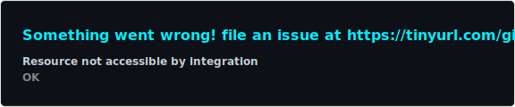

<div align="center">


<a href="https://github.com/Frostbr00">
  
</a>

<br/>

<a href="https://www.youtube.com/@frostbr0069"></a>
<a href="https://www.instagram.com/frostbr00_/"></a>
<a href="https://x.com/frostbr00"></a>
<a href="https://github.com/Frostbr00?tab=followers"></a>
<a href="https://github.com/Frostbr00?tab=repositories&sort=stargazers"></a>

</div>

<br/>

## 👾 Sobre mim

```yaml
nome: Abner Salatiel de Oliveira
alias: Frostbr00
formacao: Sistemas para Internet (SI) - Fatec
foco: [ Desenvolvimento Web, Jogos, Inteligencia Artificial ]
paixoes: [ "🎮 Games", "🚙 SUVs 4x4", "🎥 Criar conteudo" ]
status: "Construindo o futuro, uma linha de codigo por vez 🚀"
```

- 🕹️ Crio e jogo em **[Frostbr00](https://www.youtube.com/@frostbr0069)** no YouTube — gameplays e projetos próprios
- 📸 Mostro o dia a dia e os bastidores no **[Instagram](https://www.instagram.com/frostbr00_/)**
- 🎲 Desenvolvo jogos com **Godot Engine**, sites em **PHP/JS** e experimento com **IA**
- 🌱 Sempre aprendendo algo novo — hoje é a vez de aprofundar em **IA** e **experiências web imersivas**

<br/>

## ⚙️ Stack

<div align="center">

</div>

<br/>

## 📊 Estatísticas

<div align="center">




<br/>


<br/><br/>

<picture>
  <source media="(prefers-color-scheme: dark)" srcset="https://raw.githubusercontent.com/Frostbr00/Frostbr00/output/github-contribution-grid-snake-dark.svg" />
  <source media="(prefers-color-scheme: light)" srcset="https://raw.githubusercontent.com/Frostbr00/Frostbr00/output/github-contribution-grid-snake.svg" />
  
</picture>

</div>


